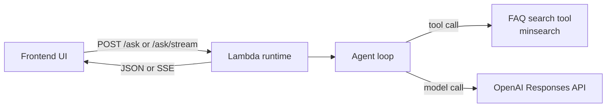

# Deploying an Agent to AWS Lambda

[Follow the tutorial on AI Shipping Labs](https://aishippinglabs.com/workshops/lambda-agent-deployment).

This project serves a Vite frontend and an OpenAI-powered FAQ agent from one AWS Lambda Function URL.

## Overview



## Project Layout

```text
.
├── backend/              # Lambda runtime, agent loop, renderers, and FAQ search
├── frontend/             # Vite UI that calls /ask/stream and renders SSE events
├── scripts/              # Local development server helpers
├── deploy/               # Lambda bootstrap, SAM template, deployment notes and scripts
├── events/               # Lambda Runtime Interface Emulator test events
├── Dockerfile            # Builds frontend assets and packages the backend Lambda image
├── deploy.sh             # Convenience wrapper around deploy/scripts/deploy-lambda.sh
└── README.md             # Project overview and local workflow
```

## Backend

- `backend/lambda_runtime.py`: custom Lambda runtime. It serves static frontend assets, handles `/health`, `/ask`, and `/ask/stream`, and writes streaming responses to the Lambda Runtime API.
- `backend/agent.py`: core agent loop using the OpenAI Responses API and the FAQ search tool.
- `backend/search.py`: lazily downloads and indexes the DataTalks.Club FAQ with `minsearch`.
- `backend/renderer.py`: renderer interfaces for collecting final answers and emitting streaming events.

## Frontend

`frontend/` contains the Vite app. During local development, Vite proxies
`/ask`, `/ask/stream`, and `/health` to the local Python backend. During Docker
builds, the compiled frontend is copied into the Lambda image and served by
`backend/lambda_runtime.py`.

## Scripts

Use `make` for common workflows. Local development helpers live in `scripts/`.
Deployment helpers live in `deploy/scripts/`.

## Local Checks

```bash
uv sync --locked
cd frontend && npm run build
deploy/scripts/build-image.sh
```

## Local Development Without Docker

Run the backend and frontend locally:

```bash
export OPENAI_API_KEY=sk-...
make dev
```

Open the Vite URL, usually `http://127.0.0.1:5173`.

This starts:

- a local Python backend on `http://127.0.0.1:8000`
- the Vite frontend on `http://127.0.0.1:5173`

The frontend proxies `/ask`, `/ask/stream`, and `/health` to the local backend,
so SSE works without rebuilding the Docker image. Frontend changes hot reload
through Vite. Backend changes require restarting `make dev` or running the
backend separately with:

```bash
make backend
```

## Testing Locally With The Production Image

Run the exact same container entrypoint through AWS Lambda Runtime Interface
Emulator, which is included in the official AWS Lambda Python base image:

```bash
export OPENAI_API_KEY=sk-...
make lambda-local
```

In another shell, invoke it with Lambda Function URL-shaped events:

```bash
curl -s http://127.0.0.1:9000/2015-03-31/functions/function/invocations \
  -d @events/health.json

curl -s http://127.0.0.1:9000/2015-03-31/functions/function/invocations \
  -d @events/index.json

curl -N http://127.0.0.1:9000/2015-03-31/functions/function/invocations \
  -d @events/ask-stream.json
```

This is invocation-level testing, not browser Function URL emulation. That keeps
local and production on the same container/runtime path without adding a local
HTTP proxy wrapper.

For streaming responses, RIE returns the raw Lambda streaming integration
payload: response metadata, eight null bytes, then the body. In AWS, the
Function URL unwraps that into normal HTTP for the browser.

## Deploying To AWS Lambda

Prerequisites:

- Docker
- AWS CLI configured for the target account
- `OPENAI_API_KEY` set in your shell

Deploy:

```bash
export AWS_REGION=us-east-1
export OPENAI_API_KEY=sk-...
./deploy.sh
```

Open the printed Function URL in the browser. The same Lambda serves `GET /` for the frontend and `POST /ask/stream` for SSE token streaming.

See [deploy/DEPLOYMENT.md](deploy/DEPLOYMENT.md) for the full deployment notes, including the
issues hit during deployment and how to avoid them next time.

Useful overrides:

```bash
AWS_REGION=eu-central-1 STACK_NAME=faq-agent-lambda ECR_REPOSITORY=faq-agent IMAGE_TAG=v1 ./deploy.sh
```

## Publishing Recommendations

- Keep application code in `backend/` and `frontend/`; keep the repo root limited
  to docs, lockfiles, and deployment config.
- Keep local development commands in `scripts/` and deployment commands in
  `deploy/scripts/`, then expose the common commands through `Makefile`.
- Do not commit `.env`, virtual environments, frontend build output, or generated
  caches. They are already ignored.
- Use a unique `IMAGE_TAG` for real deploys so CloudFormation sees changed image
  URIs.
- Before publishing, run:

```bash
uv run python -m compileall backend scripts/dev-server.py
cd frontend && npm run build
deploy/scripts/build-image.sh
```
