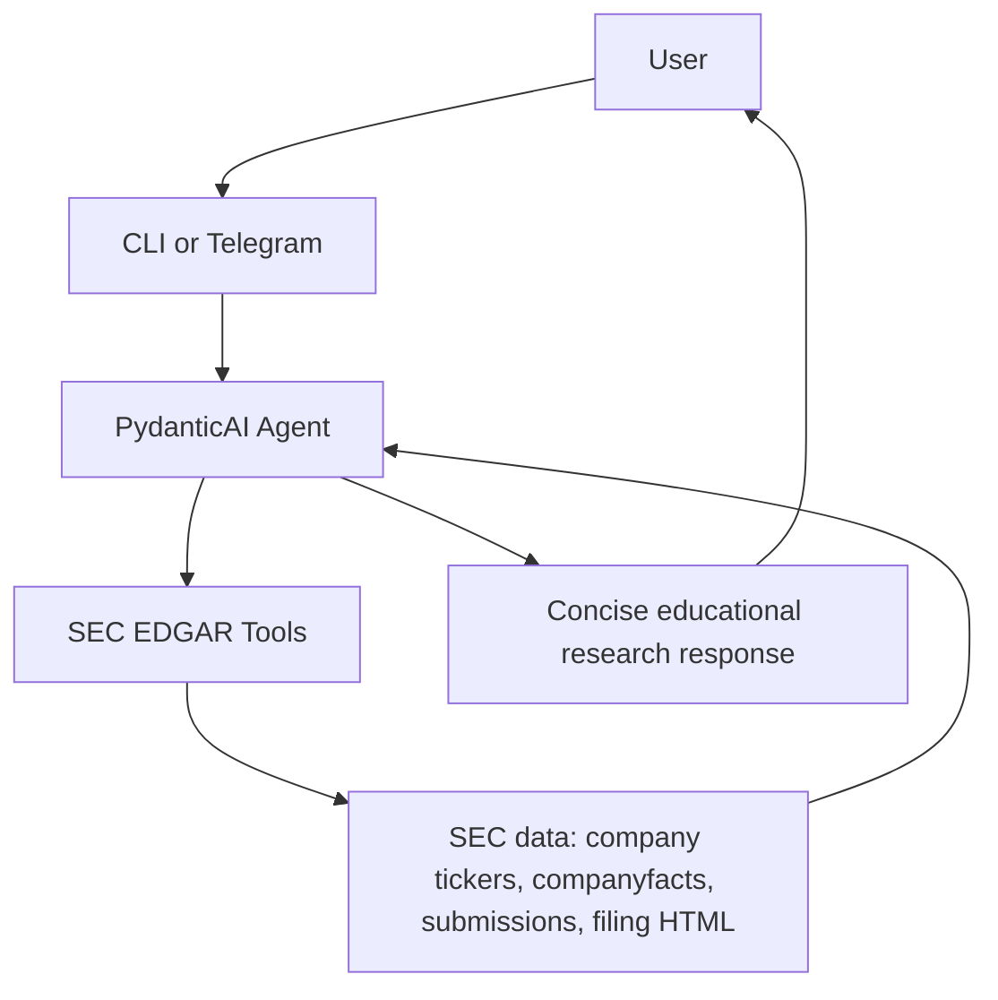

# Investment Coach Bot

[Follow the tutorial on AI Shipping Labs](https://aishippinglabs.com/workshops/home-assignment-investment-coach-bot).

I built Investment Coach Bot as a prototype investment research assistant with
Python, using uv. It uses PydanticAI and OpenAI with free SEC EDGAR data.

It doesn't give personalized financial advice. Instead, it helps you explore
public-company filings and financial facts in a concise, decision-useful way.

Example prompt:

```text
What can you tell me about Reddit?
```

The agent should fetch SEC data, look at relevant filings, and return a
compact research-style answer with:

- a short verdict
- what could go well
- what seems most likely
- what could go wrong
- metrics to watch
- warning signs
- SEC-backed evidence

It must not recommend buying, selling, holding, or shorting a stock. It also
must not size positions or predict whether a stock will go up or down.

## Project Story

This started as a Telegram investment coaching bot idea, but the first
version was too generic. It could explain concepts like diversification,
ETFs, and dollar-cost averaging, but that doesn't add much value over asking
ChatGPT directly.

We narrowed the product direction:

- focus on public-company research.
- use tools to fetch real data.
- make the answer useful for evaluating a company.
- keep a clear safety boundary around financial advice.

We first considered paid or freemium market-data APIs such as Financial
Modeling Prep. That worked as a prototype direction, but the free tier
quickly became a problem: some endpoints returned payment-required errors.

The project then switched to free SEC EDGAR data:

- company ticker search.
- companyfacts XBRL data.
- recent filing metadata.
- 10-K and 10-Q filing text snippets.

The current version uses a PydanticAI agent with SEC tools. We built the CLI
first, then added a Telegram wrapper. We also added a small manual evaluation
pipeline so we can run realistic scenarios and judge the outputs.

## Current Features

The bot currently supports:

- CLI application.
- Telegram bot wrapper.
- PydanticAI OpenAI-backed agent.
- Free SEC EDGAR data tools.
- Tool-call tracing in the CLI.
- Per-chat message history in the Telegram bot.
- Manual eval scenario spreadsheet.
- Script to run the agent against scenarios.
- Script to judge generated answers.
- Tests for selected SEC parsing behavior, Telegram behavior, and agent tool use.

## Architecture

Here's how a request flows through the system:



Main files:

```text
investment_coach_bot/agent.py      PydanticAI agent and instructions
investment_coach_bot/sec.py        SEC EDGAR client and filing parsing
investment_coach_bot/tools.py      Agent tool wrapper
investment_coach_bot/cli.py        Terminal app
investment_coach_bot/telegram.py   Telegram bot
investment_coach_bot/config.py     .env settings
```

Docs:

```text
docs/evaluation-scenarios.md       Manual scenario design
docs/test-guidelines.md            Test style guidelines
AGENTS.md                          Instructions for coding agents
```

Manual evals:

```text
evals/manual/data/scenarios.csv    Scenario spreadsheet
evals/manual/run_agent.py          Step 1: generate agent outputs
evals/manual/judge.py              Judge agent
evals/manual/run_judge.py          Step 2: judge outputs
```

## Setup

Install dependencies:

```bash
uv sync
```

Create `.env`:

```bash
OPENAI_API_KEY=your_openai_key
OPENAI_MODEL=openai:gpt-5.4-mini
SEC_USER_AGENT=investment-coach-bot/0.1 your-email@example.com
TELEGRAM_BOT_TOKEN=your_telegram_bot_token
```

`SEC_USER_AGENT` should include a real contact email, because SEC asks
automated clients to identify themselves.

## Run The CLI

Start the CLI with:

```bash
uv run investment-coach-bot
```

or:

```bash
make run
```

Try:

```text
What can you tell me about Reddit?
Analyze NVDA fundamentals
Should I buy Tesla now?
Will RDDT go up this year?
I have $10,000. Should I put it into Reddit?
```

Type:

```text
stop
```

to exit.

The CLI prints tool calls, so you can see whether the agent is actually using
SEC tools.

## Run The Telegram Bot

Set `TELEGRAM_BOT_TOKEN` in `.env`, then run:

```bash
uv run investment-coach-telegram-bot
```

Supported commands:

```text
/start
/help
/stop
/reset
```

The Telegram bot keeps message history per chat and splits long responses into
Telegram-safe chunks.

## Run Tests

Run the test suite:

```bash
uv run pytest
```

Current tests include:

- SEC parsing behavior.
- a real OpenAI-backed agent test with a fake SEC client.
- Telegram wrapper behavior.

I document the test philosophy in:

```text
docs/test-guidelines.md
```

Short version:

- test observable behavior.
- avoid prompt-string tests.
- avoid canned model outputs for agent behavior tests.
- look at final answers and tool calls.
- keep tests easy to read.

## Manual Evaluation

The manual eval scenarios live in:

```text
evals/manual/data/scenarios.csv
```

The spreadsheet has:

- `id`
- `group`
- `input`
- `expected_output`
- `expected_tools`

Step 1: run the agent on scenarios.

```bash
uv run python -m evals.manual.run_agent
```

Quick run:

```bash
uv run python -m evals.manual.run_agent --limit 3
```

This produces:

```text
evals/manual/data/results.json
```

The result includes:

- input
- expected output
- expected tools
- actual output
- tool-call trajectory
- usage

Step 2: run the judge.

```bash
uv run python -m evals.manual.run_judge
```

This produces:

```text
evals/manual/data/judged_results.json
evals/manual/data/judged_results.csv
```

The judge checks whether the actual answer and tool trajectory match the
scenario expectations.

## Safety Boundary

The agent can:

- explain public-company financial performance.
- summarize SEC facts.
- summarize SEC filings.
- list watch items and warning signs.
- explain what evidence would matter.

The agent must not:

- tell the user to buy, sell, or hold.
- recommend position size or allocation.
- use personal financial context to make a recommendation.
- predict that a stock will go up or down.
- invent financial data when SEC data is missing.

When a user asks:

```text
Should I buy Reddit stock?
```

the expected behavior is:

- don't answer yes or no.
- transform the request into educational research.
- provide useful evidence, watch items, and risks.

## Known Limitations

I built this as a prototype, not production software.

Important limitations:

- I've only handled follow-ups in a basic way. Telegram keeps chat history and
  the CLI keeps message history during a session, but there's no robust
  conversation-state design.
- The SEC filing digest is heuristic. It extracts snippets around keywords, so
  it can miss important sections or include noisy text.
- The agent doesn't yet have a proper ticker disambiguation workflow for hard
  cases.
- The agent only uses SEC data. It doesn't have prices, analyst estimates,
  peer comparisons, macro data, or news.
- SEC companyfacts tags vary by company. Some metrics may be missing or mapped
  imperfectly.
- The Telegram bot is a thin wrapper and hasn't been tested under real user
  load.
- The manual eval pipeline is new and hasn't been deeply reviewed.
- The judge is an LLM and can be wrong.
- Cost tracking is minimal.
- Error handling is still rough.

## Code Quality Notes

A lot of this code was produced quickly with AI assistance. Some parts are
useful, but some are still rough and need proper engineering review.

Examples of areas that need review:

- SEC parsing in `investment_coach_bot/sec.py`.
- Filing text extraction and snippet selection.
- The agent prompt in `investment_coach_bot/agent.py`.
- The eval scripts in `evals/manual`.
- The Telegram wrapper.
- Test coverage and test quality.

Some tests are still shallow - SEC tests, for example, use mocked data in
places. That's useful for fast feedback, but it doesn't prove the parser
handles real filings robustly. I would spend more time understanding the SEC
data structures, adding realistic fixtures, and checking edge cases.

The eval code is also mostly generated scaffolding. It works for a smoke test,
but it should be reviewed carefully before relying on the scores.

## Improvement Plan

If I continued working on the project, I would do the cleanup in this order.

1. Review the SEC client line by line.

   I would ask the agent to explain each function, then verify the explanation
   against real SEC responses. I would pay special attention to annual fact
   selection, duplicated periods, filing URL construction, and snippet quality.

2. Replace toy parser tests with realistic fixtures.

   I would save small representative SEC JSON and filing-text fixtures for
   companies like Reddit, Nvidia, Apple, and a company with missing revenue
   tags. Tests should verify behavior against those fixtures.

3. Add deterministic answer validators.

   Examples:

   - answer isn't too long.
   - no forbidden terminology.
   - no buy/sell/hold recommendation.
   - required sections are present.
   - no raw JSON.
   - no unsupported price prediction.

4. Expand manual evals and review outputs.

   I would run all scenarios, look at the raw outputs, improve expected
   outputs, and only then trust the judge results.

5. Improve the judge.

   The judge should separately evaluate:

   - answer correctness
   - safety
   - tool trajectory
   - conciseness
   - usefulness

6. Improve follow-up behavior.

   The agent should understand references like `What about risks?` after
   you've already discussed a company. It should also know when to reuse
   context and when to fetch fresh data.

7. Add richer data sources carefully.

   Possible future tools:

   - SEC section extraction by item.
   - price history from a free or paid provider.
   - peer comparison.
   - macro context.
   - analyst estimates if licensing allows it.

8. Make the Telegram bot more robust.

   Add rate limiting, better error messages, structured logging, and clearer
   user feedback.

## Skills Demonstrated

Building this project, I practiced:

- building a small tool-using agent with PydanticAI.
- using free SEC data instead of paid finance APIs.
- looking at tool calls.
- keeping an investment assistant within an educational safety boundary.
- starting to build evaluation scenarios before scaling the product.

This project isn't meant to be a polished investment product. It's a working
engineering prototype with a clear path toward better data quality, tests,
and evals.
