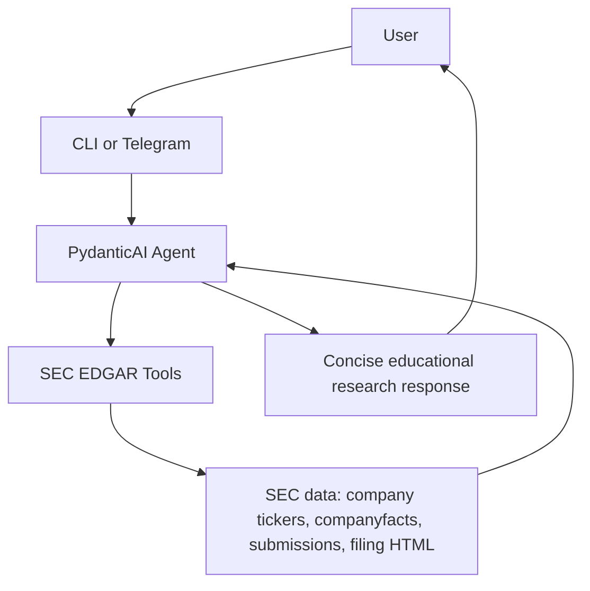

# Investment Coach Bot

Investment Coach Bot is a prototype investment research assistant built with
Python, uv, PydanticAI, OpenAI, and free SEC EDGAR data.

The goal is not to give personalized financial advice. The goal is to help a
user explore public-company filings and financial facts in a concise,
decision-useful way.

Example prompt:

```text
What can you tell me about Reddit?
```

The agent should fetch SEC data, inspect relevant filings, and return a compact
research-style answer with:

- a short verdict;
- what could go well;
- what seems most likely;
- what could go wrong;
- metrics to watch;
- warning signs;
- SEC-backed evidence.

It must not recommend buying, selling, holding, shorting, position sizing, or
predicting whether a stock will go up or down.

## Project Story

This started as a Telegram investment coaching bot idea. The first version was
too generic: it could explain concepts like diversification, ETFs, or
dollar-cost averaging, but that does not add much value over asking ChatGPT
directly.

We narrowed the product direction:

- focus on public-company research;
- use tools to fetch real data;
- make the answer useful for evaluating a company;
- keep a clear safety boundary around financial advice.

We first considered paid or freemium market-data APIs such as Financial Modeling
Prep. That worked as a prototype direction, but the free tier quickly became a
problem: some endpoints returned payment-required errors.

The project then switched to free SEC EDGAR data:

- company ticker search;
- companyfacts XBRL data;
- recent filing metadata;
- 10-K and 10-Q filing text snippets.

The current version uses a PydanticAI agent with SEC tools. The CLI came first,
then a Telegram wrapper was added. We also added a small manual evaluation
pipeline so we can run realistic scenarios and judge the outputs.

## Current Features

- CLI application.
- Telegram bot wrapper.
- PydanticAI OpenAI-backed agent.
- Free SEC EDGAR data tools.
- Tool-call tracing in the CLI.
- Per-chat message history in the Telegram bot.
- Manual eval scenario spreadsheet.
- Script to run the agent against scenarios.
- Script to judge generated answers.
- Tests for selected SEC parsing behavior, Telegram behavior, and agent tool use.

## Architecture



Main files:

```text
investment_coach_bot/agent.py      PydanticAI agent and instructions
investment_coach_bot/sec.py        SEC EDGAR client and filing parsing
investment_coach_bot/tools.py      Agent tool wrapper
investment_coach_bot/cli.py        Terminal app
investment_coach_bot/telegram.py   Telegram bot
investment_coach_bot/config.py     .env settings
```

Docs:

```text
docs/evaluation-scenarios.md       Manual scenario design
docs/test-guidelines.md            Test style guidelines
AGENTS.md                          Instructions for coding agents
```

Manual evals:

```text
evals/manual/data/scenarios.csv    Scenario spreadsheet
evals/manual/run_agent.py          Step 1: generate agent outputs
evals/manual/judge.py              Judge agent
evals/manual/run_judge.py          Step 2: judge outputs
```

## Setup

Install dependencies:

```bash
uv sync
```

Create `.env`:

```bash
OPENAI_API_KEY=your_openai_key
OPENAI_MODEL=openai:gpt-5.4-mini
SEC_USER_AGENT=investment-coach-bot/0.1 your-email@example.com
TELEGRAM_BOT_TOKEN=your_telegram_bot_token
```

`SEC_USER_AGENT` should include a real contact email. SEC asks automated clients
to identify themselves.

## Run The CLI

```bash
uv run investment-coach-bot
```

or:

```bash
make run
```

Try:

```text
What can you tell me about Reddit?
Analyze NVDA fundamentals
Should I buy Tesla now?
Will RDDT go up this year?
I have $10,000. Should I put it into Reddit?
```

Type:

```text
stop
```

to exit.

The CLI prints tool calls, so you can see whether the agent is actually using
SEC tools.

## Run The Telegram Bot

Set `TELEGRAM_BOT_TOKEN` in `.env`, then run:

```bash
uv run investment-coach-telegram-bot
```

Supported commands:

```text
/start
/help
/stop
/reset
```

The Telegram bot keeps message history per chat and splits long responses into
Telegram-safe chunks.

## Run Tests

```bash
uv run pytest
```

Current tests include:

- SEC parsing behavior;
- a real OpenAI-backed agent test with a fake SEC client;
- Telegram wrapper behavior.

The test philosophy is documented in:

```text
docs/test-guidelines.md
```

Short version:

- test observable behavior;
- avoid prompt-string tests;
- avoid canned model outputs for agent behavior tests;
- inspect final answers and tool calls;
- keep tests easy to read.

## Manual Evaluation

The manual eval scenarios live in:

```text
evals/manual/data/scenarios.csv
```

The spreadsheet has:

- `id`
- `group`
- `input`
- `expected_output`
- `expected_tools`

Step 1: run the agent on scenarios.

```bash
uv run python -m evals.manual.run_agent
```

Quick run:

```bash
uv run python -m evals.manual.run_agent --limit 3
```

This produces:

```text
evals/manual/data/results.json
```

The result includes:

- input;
- expected output;
- expected tools;
- actual output;
- tool-call trajectory;
- usage.

Step 2: run the judge.

```bash
uv run python -m evals.manual.run_judge
```

This produces:

```text
evals/manual/data/judged_results.json
evals/manual/data/judged_results.csv
```

The judge checks whether the actual answer and tool trajectory match the
scenario expectations.

## Safety Boundary

The agent can:

- explain public-company financial performance;
- summarize SEC facts;
- summarize SEC filings;
- list watch items and warning signs;
- explain what evidence would matter.

The agent must not:

- tell the user to buy, sell, or hold;
- recommend position size or allocation;
- use personal financial context to make a recommendation;
- predict that a stock will go up or down;
- invent financial data when SEC data is missing.

When a user asks:

```text
Should I buy Reddit stock?
```

the expected behavior is:

- do not answer yes or no;
- transform the request into educational research;
- provide useful evidence, watch items, and risks.

## Known Limitations

This is a prototype, not production software.

Important limitations:

- Follow-up handling is basic. Telegram keeps chat history and the CLI keeps
  message history during a session, but there is no robust conversation-state
  design.
- The SEC filing digest is heuristic. It extracts snippets around keywords, so
  it can miss important sections or include noisy text.
- The agent does not yet have a proper ticker disambiguation workflow for hard
  cases.
- The agent only uses SEC data. It does not have prices, analyst estimates,
  peer comparisons, macro data, or news.
- SEC companyfacts tags vary by company. Some metrics may be missing or mapped
  imperfectly.
- The Telegram bot is a thin wrapper and has not been tested under real user
  load.
- The manual eval pipeline is new and has not been deeply reviewed.
- The judge itself is an LLM and can be wrong.
- Cost tracking is minimal.
- Error handling is still rough.

## Code Quality Notes

A lot of this code was produced quickly with AI assistance. Some parts are
useful, but some are still rough and need proper engineering review.

Examples of areas that need review:

- SEC parsing in `investment_coach_bot/sec.py`.
- Filing text extraction and snippet selection.
- The agent prompt in `investment_coach_bot/agent.py`.
- The eval scripts in `evals/manual`.
- The Telegram wrapper.
- Test coverage and test quality.

Some tests are still shallow. For example, SEC tests use mocked data in places.
That is useful for fast feedback, but it does not prove the parser handles real
filings robustly. I would spend more time understanding the SEC data shapes,
adding realistic fixtures, and checking edge cases.

The eval code is also mostly generated scaffolding. It works for a smoke test,
but it should be reviewed carefully before relying on the scores.

## How I Would Improve This

If I continued working on the project, I would do the cleanup in this order.

1. Review the SEC client line by line.

   I would ask the agent to explain each function, then verify the explanation
   against real SEC responses. I would pay special attention to annual fact
   selection, duplicated periods, filing URL construction, and snippet quality.

2. Replace toy parser tests with realistic fixtures.

   I would save small representative SEC JSON and filing-text fixtures for
   companies like Reddit, Nvidia, Apple, and a company with missing revenue
   tags. Tests should verify behavior against those fixtures.

3. Add deterministic answer validators.

   Examples:

   - answer is not too long;
   - no forbidden terminology;
   - no buy/sell/hold recommendation;
   - required sections are present;
   - no raw JSON;
   - no unsupported price prediction.

4. Expand manual evals and review outputs.

   I would run all scenarios, inspect the raw outputs, improve expected outputs,
   and only then trust the judge results.

5. Improve the judge.

   The judge should separately evaluate:

   - answer correctness;
   - safety;
   - tool trajectory;
   - conciseness;
   - usefulness.

6. Improve follow-up behavior.

   The agent should understand references like “what about risks?” after a
   company has already been discussed. It should also know when to reuse context
   and when to fetch fresh data.

7. Add richer data sources carefully.

   Possible future tools:

   - SEC section extraction by item;
   - price history from a free or paid provider;
   - peer comparison;
   - macro context;
   - analyst estimates if licensing allows it.

8. Harden Telegram.

   Add rate limiting, better error messages, structured logging, and clearer
   user feedback.

## What This Project Demonstrates

This prototype shows:

- how to build a small tool-using agent with PydanticAI;
- how to use free SEC data instead of paid finance APIs;
- how to inspect tool calls;
- how to keep an investment assistant within an educational safety boundary;
- how to start building evaluation scenarios before scaling the product.

It is intentionally not a polished investment product. It is a working
engineering prototype with a clear path toward better data quality, tests, and
evals.
