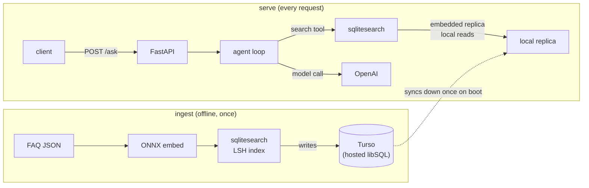

# Deploying Vector Search with SQLite

[Follow the tutorial on AI Shipping Labs](https://aishippinglabs.com/workshops/vector-search-sqlite).

Workshop code for the AI Shipping Labs session **"Deploying Vector Search with SQLite"** (June 9, 2026).

It builds on the [End-to-End Agent Deployment](../2026-04-21-end-to-end-agent-deployment) workshop. That agent answered FAQ questions using **minsearch**, an in-memory keyword index rebuilt on every boot. Here we make retrieval **persistent and free to host** in two steps:

1. **Swap minsearch for `sqlitesearch`** — real vector (semantic) search that lives in a single SQLite file instead of memory.
2. **Host that SQLite database on Turso** — so the data survives restarts even on free/ephemeral hosts, with no Postgres and no paid disk.

## Overview



## What is Turso?

[**Turso**](https://turso.tech) is a hosted database built on **libSQL**, an open-source fork of SQLite. In short: **SQLite that runs on a server you connect to over the network.**

Why it matters here: a plain SQLite file is great until you deploy to a host whose disk gets wiped on every restart (most free tiers). Turso keeps the data on its own infrastructure, so it persists no matter how ephemeral your app host is — and its free tier doesn't expire (~5 GB storage, 500M row reads/month, no credit card to start).

This app uses Turso in **embedded-replica** mode: the data syncs down to a local file once on boot, and all search reads run against that local file (fast, no per-query network hops). Turso is just the durable source of truth.

## Why this stack

- **`sqlitesearch`** does approximate vector search (LSH / IVF / HNSW) and FTS5 text search entirely inside one SQLite file — no extension to compile, no vector database to run. We use **LSH** here, tuned for a few hundred docs (`hash_size=8, n_probe=4`).
- **ONNX embeddings** (`Xenova/all-MiniLM-L6-v2`, 384-dim) run locally via `onnxruntime` — embeddings are free and need no PyTorch and no embedding API. OpenAI is used **only** for the agent's answers.
- **Turso** provides free, durable storage so the index outlives the host's disk.

The result deploys to any free host with three secrets and no database server.

## Prerequisites

- Python 3.14 + [`uv`](https://docs.astral.sh/uv/)
- An OpenAI API key (for the agent)
- A free [Turso](https://turso.tech) account + the [Turso CLI](https://docs.turso.tech/cli/installation)
- `sqlitesearch >= 0.1.0` (transparent local/Turso `db_path` interface) — the libSQL backend is pulled in via the `[libsql]` extra

## Setup

Create a Turso database and read off its URL + token:

```bash
turso db create faq
turso db show faq --url         # -> DB_PATH (libsql:// URL)
turso db tokens create faq      # -> TURSO_AUTH_TOKEN
```

Put them in `.env`:

```
OPENAI_API_KEY=sk-...
DB_PATH=libsql://faq-<org>.turso.io
TURSO_AUTH_TOKEN=...
```

`DB_PATH` is the one variable that picks the database: a `libsql://` URL points
at Turso, while a local path (the default `data/faq.db`) keeps everything on
disk.

Install and build the index. With a `libsql://` `DB_PATH`, ingest writes straight to Turso:

```bash
make install      # uv sync
make download     # fetch the ONNX embedding model into models/
make ingest       # fetch FAQ -> embed (ONNX) -> write the index to Turso
```

`sqlitesearch` batches the inserts, so the bulk load to Turso stays fast. Leave
`DB_PATH` unset to build a local `data/faq.db` for offline testing instead.

## Run

```bash
make run
curl -s localhost:8000/health
curl -s -X POST localhost:8000/ask \
  -H 'Content-Type: application/json' \
  -d '{"question":"How do I install the dependencies for the course?"}'
```

On boot the app opens the Turso-backed index, syncs the documents down to a
local replica, and serves vector searches locally. `/ask` runs the agent, which
calls the `search` tool, embeds the question with ONNX, and answers from the
retrieved FAQ entries (with sources).

## What's In This Code

- `config.py` — shared config and the `open_vector_index()` factory. It holds the LSH settings in one place so ingest and serve build the index identically. `DB_PATH` is Turso-backed when it is a `libsql://` URL, otherwise a plain local SQLite file.
- `embedder.py` — local ONNX text embedder (mean-pooled, L2-normalized) so cosine similarity is a dot product. No PyTorch.
- `download.py` — downloads the ONNX model + tokenizer from HuggingFace into `models/` (build time only).
- `ingest.py` — the offline half: fetch FAQ → embed → build the vector index. Writes to Turso when `DB_PATH` is a `libsql://` URL, otherwise to a local SQLite file.
- `search.py` — the serve half: opens the Turso-backed index (syncs down), embeds the incoming query, returns nearest FAQ documents. Also defines the `search` tool schema shown to the model.
- `agent.py` — the agent loop: sends the question to OpenAI, runs the `search` tool when the model asks, feeds results back, and produces a grounded answer.
- `app.py` — FastAPI app: `GET /health` and `POST /ask`.
- `renderer.py` — `CollectingRenderer` gathers the streamed tokens + tool calls into the final JSON response.
- `schemas.py` — Pydantic request/response models.

## Deploying for free

The data lives in Turso, so the app host needs no persistent disk. Point any
free host (Render, Hugging Face Spaces, Fly, …) at this code and set three
secrets — `OPENAI_API_KEY`, `DB_PATH` (the `libsql://` URL), `TURSO_AUTH_TOKEN`
— plus bake the `models/` directory in (or run `make download` at build).
