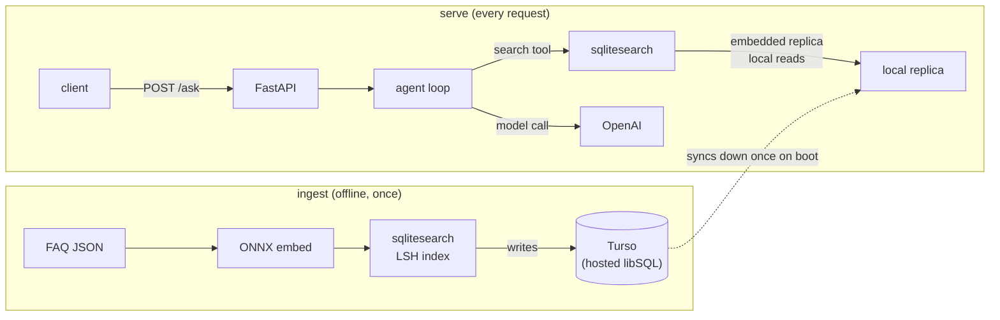

# Deploying Vector Search with SQLite

[Follow the tutorial on AI Shipping Labs](https://aishippinglabs.com/workshops/vector-search-sqlite).

In this AI Shipping Labs session, "Deploying Vector Search with SQLite" (June 9, 2026), we add persistent vector search to an FAQ agent.

We build on the [End-to-End Agent Deployment](../2026-04-21-end-to-end-agent-deployment) workshop, where we answered FAQ questions with `minsearch`.

Because that in-memory keyword index is rebuilt on every boot, we make retrieval persistent and free to host in two steps:

1. Replace `minsearch` with `sqlitesearch` to run vector (semantic) search from a single SQLite file instead of memory.
2. Host the SQLite database on Turso so the data survives restarts on free, ephemeral hosts without Postgres or paid disk.

## Overview

The agent uses a local replica for fast searches while Turso stores the durable index:



## Turso

[Turso](https://turso.tech) is a hosted database built on `libSQL`, an open-source fork of SQLite. You can think of it as SQLite running on a server that you access over the network.

You can use a plain SQLite file until you deploy to a host that wipes its disk on every restart, as most free tiers do. Turso stores the data on its own infrastructure, so an ephemeral app host can't erase it. Its free tier includes about 5 GB of storage and 500 million row reads per month. You don't need a credit card to start, and the tier doesn't expire.

We use Turso in embedded-replica mode. On boot, we sync the data to a local file and run every search against that file, avoiding a network request for each query. We use Turso only to store the durable copy.

## Stack choices

We use three pieces to keep vector search local and the index durable:

- `sqlitesearch` runs approximate vector search (LSH, IVF, or HNSW) and FTS5 text search inside one SQLite file. You don't need to compile an extension or run a vector database. We use LSH here and tune it for a few hundred documents with `hash_size=8, n_probe=4`.
- We generate 384-dimensional ONNX embeddings with `Xenova/all-MiniLM-L6-v2` and `onnxruntime`. They run locally without PyTorch or an embedding API, while we use OpenAI only for the agent's answers.
- We store the index on Turso so the app host can wipe its disk without removing the index.

You can deploy the app to any free host with three secrets and no database server.

## Prerequisites

Before you start, install or create these dependencies:

- Python 3.14 + [`uv`](https://docs.astral.sh/uv/)
- An OpenAI API key (for the agent)
- A free [Turso](https://turso.tech) account + the [Turso CLI](https://docs.turso.tech/cli/installation)
- `sqlitesearch >= 0.1.0` for the same `db_path` interface with local SQLite and Turso. The `[libsql]` extra installs the libSQL backend.

## Setup

Create a Turso database, then retrieve the URL and token:

```bash
turso db create faq
turso db show faq --url         # -> DB_PATH (libsql:// URL)
turso db tokens create faq      # -> TURSO_AUTH_TOKEN
```

Add the URL, token, and OpenAI API key to `.env`:

```text
OPENAI_API_KEY=sk-...
DB_PATH=libsql://faq-<org>.turso.io
TURSO_AUTH_TOKEN=...
```

Set `DB_PATH` to a `libsql://` URL for Turso or to a local path for an on-disk database. If you don't set it, the app uses `data/faq.db`.

Run these commands to install dependencies, download the model, and build the index:

```bash
make install      # uv sync
make download     # fetch the ONNX embedding model into models/
make ingest       # fetch FAQ -> embed (ONNX) -> write the index to Turso
```

With a `libsql://` `DB_PATH`, `make ingest` writes batches directly to Turso. Leave `DB_PATH` unset to build a local `data/faq.db` for offline testing instead.

## Run

Start the app, check its health, and ask a question:

```bash
make run
curl -s localhost:8000/health
curl -s -X POST localhost:8000/ask \
  -H 'Content-Type: application/json' \
  -d '{"question":"How do I install the dependencies for the course?"}'
```

On boot, we open the Turso-backed index and sync the documents to a local replica. We then serve vector searches from that replica. When you call `/ask`, the agent calls the `search` tool, embeds the question with ONNX, and answers from the retrieved FAQ entries with sources.

## Code map

We separate configuration, ingestion, search, and request handling across these files:

- `config.py`: shared configuration and the `open_vector_index()` factory, with LSH settings that keep ingestion and search consistent. Set `DB_PATH` to a `libsql://` value to use Turso. Use any other value for a local SQLite file.
- `embedder.py`: a local, mean-pooled, L2-normalized ONNX text embedder that turns cosine similarity into a dot product without PyTorch.
- `download.py`: download code for the ONNX model and tokenizer from Hugging Face into `models/` at build time.
- `ingest.py`: offline code that fetches the FAQ, embeds it, and builds the vector index. A `libsql://` value for `DB_PATH` sends writes to Turso. Any other value sends them to a local SQLite file.
- `search.py`: request-time code that opens and syncs the Turso-backed index, embeds an incoming query, and returns the nearest FAQ documents. It also contains the `search` tool schema shown to the model.
- `agent.py`: the agent loop that sends the question to OpenAI, runs the `search` tool when requested, returns the results to the model, and produces a grounded answer.
- `app.py`: the FastAPI app with `GET /health` and `POST /ask`.
- `renderer.py`: the `CollectingRenderer`, which gathers streamed tokens and tool calls into the final JSON response.
- `schemas.py`: the Pydantic request and response models.

## Deploying for free

We store the data in Turso, so the app host needs no persistent disk. Deploy the code to a free host such as Render, Hugging Face Spaces, or Fly. Set `OPENAI_API_KEY`, `DB_PATH` with the `libsql://` URL, and `TURSO_AUTH_TOKEN`. Include the `models/` directory in the image or run `make download` during the build.
