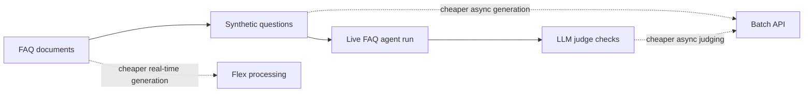

# Saving Money with Batch and Flex

This directory contains the workshop code for the AI Shipping Labs session
"Saving Money with Batch and Flex" on July 3, 2026.

The workshop uses an FAQ agent evaluation pipeline to show where OpenAI Batch,
Flex processing, and prompt caching reduce cost without changing the core eval
workflow.

## Overview



## Prerequisites

- Python 3.14+
- `uv`
- OpenAI API key in `.env`

```bash
OPENAI_API_KEY=sk-...
```

## What's In This Code

- `agent.py`, `search.py`, `renderer.py`: a minimal FAQ agent used as the eval
  target.
- `cli.py`: quick terminal runner for trying the FAQ agent by hand.
- `evals/synthetic/generate.py`: baseline live generation of synthetic eval
  questions.
- `evals/synthetic/generate_batch.py`: the same question generation through the
  Batch API.
- `evals/synthetic/run.py`: runs the live FAQ agent on generated questions and
  records answers plus tool-call trajectories.
- `evals/synthetic/judge.py`: LLM judge prompts and output schemas.
- `evals/synthetic/run_judge_batch.py`: runs judge checks through the Batch API.
- `evals/synthetic/flex/generate_flex.py`: uses Flex processing for cheaper
  real-time generation with token/cost reporting.
- `evals/synthetic/flex/flex_caching_example.py`: demonstrates Flex plus prompt
  caching on repeated requests with a large shared prompt prefix.
- `evals/synthetic/data/questions_sample.csv`: small sample question set for
  running the agent without generating a full dataset first.
- `evals/synthetic/data/evals_run_sample.json`: small sample agent run for
  trying the judge batch flow.

Generated batch state files, JSONL inputs, full eval outputs, and Flex output
datasets are intentionally git-ignored.

## Setup

```bash
uv sync --locked
cp env.example .env  # or create .env yourself
```

If you create `.env` manually:

```bash
OPENAI_API_KEY=sk-...
```

## Try The Agent

```bash
uv run python cli.py "How do I install Kafka?"
```

## Baseline: Live Synthetic Generation

```bash
uv run python -m evals.synthetic.generate --num-docs 10
```

This sends live model requests immediately. It is simple, but it pays standard
real-time pricing.

## Cheaper Async Generation With Batch

```bash
uv run python -m evals.synthetic.generate_batch submit --num-docs 10
uv run python -m evals.synthetic.generate_batch status
uv run python -m evals.synthetic.generate_batch fetch
```

Or run all phases in one command:

```bash
uv run python -m evals.synthetic.generate_batch run --num-docs 10
```

Batch is asynchronous and can take up to 24 hours, but it is substantially
cheaper for independent offline requests.

## Run The Agent Eval

Use the included sample questions:

```bash
uv run python -m evals.synthetic.run --limit 5 --concurrency 3
```

Or point it at a generated dataset:

```bash
uv run python -m evals.synthetic.run \
  --questions evals/synthetic/data/questions_generated.csv \
  --limit 20
```

The agent run stays live because each question may involve multiple model calls
and tool calls.

## Cheaper Judging With Batch

Use the included sample agent run:

```bash
uv run python -m evals.synthetic.run_judge_batch submit \
  --data evals/synthetic/data/evals_run_sample.json
uv run python -m evals.synthetic.run_judge_batch status \
  --data evals/synthetic/data/evals_run_sample.json
uv run python -m evals.synthetic.run_judge_batch fetch \
  --data evals/synthetic/data/evals_run_sample.json
```

Judging is a good Batch fit because every judge call is independent.

## Flex Processing

Generate synthetic questions through the Flex tier:

```bash
uv run python -m evals.synthetic.flex.generate_flex --num-docs 10
```

Show prompt caching with a large stable prefix:

```bash
uv run python -m evals.synthetic.flex.flex_caching_example --requests 4
```

Flex gives lower-cost real-time processing when capacity is available. The demo
retries temporary Flex capacity errors and falls back to standard service tier.
