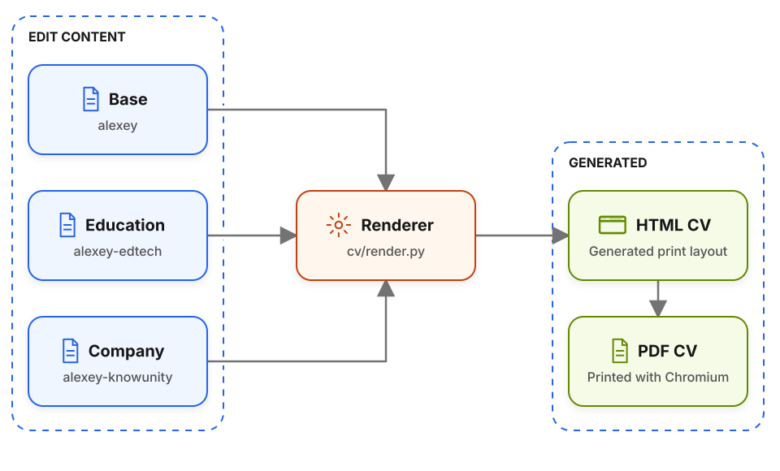

# AI CV Pipeline

[Follow the tutorial on AI Shipping Labs](https://aishippinglabs.com/workshops/tailor-cv-ai-engineering).

This directory contains the workshop code and example data for building focused,
ATS-friendly AI engineering CVs from structured YAML.

Each tailored CV has its own editable YAML source. All variants use the same
renderer, and HTML and PDF are derived outputs:

<picture>
  <source media="(prefers-color-scheme: dark)" srcset="diagrams/overview-dark.svg">
  
</picture>

Generated `cv.html` and `cv.pdf` files are intentionally git-ignored.

## What's In This Code

- `CV-PROCESS.md`: reusable editorial playbook for turning raw CV material into a
  focused AI engineering resume.
- `cv/render.py`: self-contained `uv` script that renders YAML into a
  print-ready Harvard-format HTML CV.
- `cv/README.md`: renderer usage, folder conventions, and YAML conventions.
- `cv/alexey/cv.yml`: base public example.
- `cv/alexey-edtech/cv.yml`: education-focused variant.
- `cv/alexey-knowunity/cv.yml`: company-targeted variant.

## Running Locally

```bash
cd cv
uv run render.py alexey
uv run render.py alexey-edtech
uv run render.py alexey-knowunity
```

To make a PDF from a rendered HTML file:

```bash
chromium --headless --no-pdf-header-footer \
  --print-to-pdf=alexey/cv.pdf file://$PWD/alexey/cv.html
```

## Publication Boundary

Only public example CV sources are included here. Generated HTML/PDF outputs,
local work-in-progress CVs, and other people's CV materials are excluded by
`.gitignore`.
