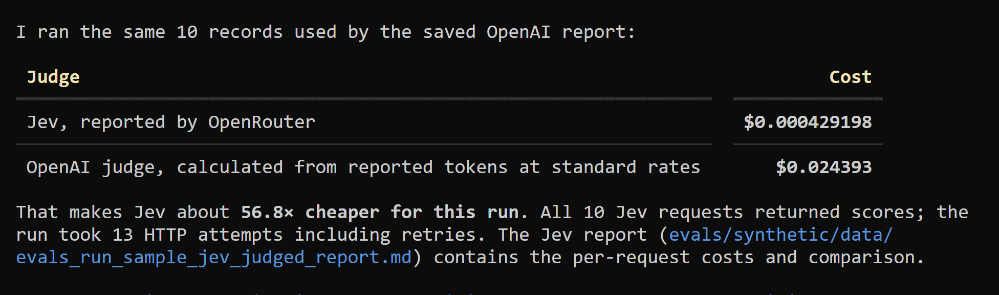

# Using Jev for LLM Evaluations

[Follow the tutorial on AI Shipping Labs](https://aishippinglabs.com/workshops/jev-for-llm-evaluations).

Workshop code for the AI Shipping Labs session "Using Jev for LLM
Evaluations" on September 22, 2026.

The FAQ agent answers Data Engineering Zoomcamp questions by searching the
public course FAQ. A small eval pipeline runs the agent over a fixed question
set and scores every answer with three LLM judges that share the same three
good/bad checks — answer correctness, instruction following, and trajectory
optimality:

- `evals/synthetic/run_judge.py` — the OpenAI baseline: `gpt-5.4-mini` with
  structured outputs and written reasoning per check.
- `evals/synthetic/run_jev_judge.py` — [Jev](https://openrouter.ai/typesafe/jev-1.13/api)
  through OpenRouter's decisions API: one request per entry, typed `good`/`bad`
  choices and probabilities, no generated prose.
- `evals/synthetic/run_laya_judge.py` — [Laya](https://github.com/NandhaKishorM/laya)
  running locally: the same request scored by an open-weights decision model,
  no API key needed.

The check definitions, request bodies, reports, and CLI plumbing for the two
typed-decision judges live in `evals/synthetic/judge_common.py`, so Jev and
Laya stay in sync by construction.

## Prerequisites

- Python 3.14+
- `uv`
- `OPENAI_API_KEY` in `.env` for the agent and the baseline judge
- `OPENROUTER_API_KEY` in `.env` to run the Jev judge

```
OPENAI_API_KEY=sk-...
OPENROUTER_API_KEY=your-openrouter-key
```

## Setup

```bash
uv sync --locked
cp env.example .env   # then put your keys in .env
```

## Try the agent

```bash
uv run python cli.py "How do I install Kafka?"
```

Empty invocation starts a small REPL.

## Evals

Sample data is already in `evals/synthetic/data/` — `questions_sample.csv` is
the gold-standard question set and `evals_run_sample.json` is a recorded agent
run — so you can run the judges without generating anything first.

Run the agent on the questions. Each question is a live tool-calling loop; a
run produces a dated `evals_run_*.json` with answers and tool trajectories:

```bash
uv run python -m evals.synthetic.run --limit 5 --concurrency 3
```

### Judge with the OpenAI baseline

Three checks per entry: answer correctness, instruction following, and
trajectory optimality.

```bash
uv run python -m evals.synthetic.run_judge \
  --data evals/synthetic/data/evals_run_sample.json \
  --limit 5
```

Omit `--data` to judge the sample file. The script writes
`<input>_judged.json` next to the run file, prints score counts plus token
and dollar cost, and writes `<input>_judged_report.md` (and a `.json` twin).

### Judge with Jev

```bash
uv run python -m evals.synthetic.run_jev_judge \
  --data evals/synthetic/data/evals_run_sample.json \
  --limit 5
```

It uses `OPENROUTER_API_KEY` from `.env`. Each eval entry becomes one Jev
`state` — the question, reference answer, agent answer, agent instructions,
and tool calls (without search results) — with the three checks as choice
questions. Independent entries use separate requests with bounded parallelism
(`--concurrency`, default 5). Results go to `<input>_jev_judged.json` with
JSON and Markdown reports, leaving the OpenAI judge's output intact. Jev
returns `good`/`bad` choices and probabilities, but no written reasoning; the
report reads the actual cost from OpenRouter's `usage.cost` rather than
estimating it.

On the 10-entry sample, judging with Jev cost about 57× less than the OpenAI
baseline judge:



When a saved OpenAI report covers the same input file, the Jev report adds
this cost comparison automatically. Different models can disagree on
individual scores.

### Judge with Laya

```bash
uv sync --locked --extra laya
uv run --locked --extra laya python -m evals.synthetic.run_laya_judge \
  --data evals/synthetic/data/evals_run_sample.json \
  --limit 5
```

This loads the `convaiinnovations/laya` `typed-decisions` checkpoint from
Hugging Face on first use (about 843 MB of model weights), then scores the
three checks locally. No API key is needed for this judge; `--device cpu`,
`--device cuda`, or `--device mps` overrides automatic device selection.
Results go to `<input>_laya_judged.json` and matching JSON and Markdown
reports. Laya returns probabilities but no written reasoning. Entries
exceeding the checkpoint's safe input budget receive `error` scores rather
than a decision on silently truncated text.

On CPU, the runner judges entries concurrently with up to six workers; use
`--workers 1` to run serially. Most of the runtime is loading the
421M-parameter checkpoint, so a GPU or a long-running model service pays off
for larger runs.

## Comparing judges

Treat these as experimental model judgments. In a five-entry sample, Laya
marked all 15 checks `good`, while both the OpenAI and Jev judges marked one
answer incorrect. In a separate obvious-failure probe (wrong answer and no
search calls), Laya marked correctness `bad` but still marked instruction
following and trajectory `good`. Compare judge outputs against human-reviewed
examples before using any of them as an automatic quality gate.
